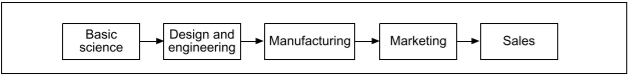

# Zusammenfassungen 

## The Era of Open Innovation
Zusammengefasst tun Firmen besser daran andere Firmen mit Technologien experimentieren zu lassen 
und dann die Erfolgreichen aufzukaufen, als selber zu experimentieren.

### Contrasting Principles of Closed and Open Innovation
Closed Innovation Principles
* The smart people in the field work for us
* To profit from R&D, we must discover, develop and ship it ourselves
* If we discover it ourselves, we will get it to market first
* If we are the first to commercialize an innovation, we will win
* If we create the most and best ideas in the industry, we will win
* We should control our intellectual property (IP) so that our competitors don't profit from our 
  ideas

Open Innovation Principles
* Not all the smart people work for us, so we must find and tap into the knowledge and 
  expertise of bright individuals outside our company
* External R&D can create significant value; internal R&D is needed to claim some portion of 
  that value
* Building a better business model is better than getting to market first
* If we make the best use of internal and external ideas, we will win.
* We should profit from others use of our IP, and we should buy others IP whenever it advances 
  our own business model

## Towards the Fifth-generation Innovation Process

Most important factors time/cost tradeoffs
* Direct benefits of being first
* Direct costs of accelerating product development
* Indirect cost of accelerating product development
* Influence of timeliness on customer satisfaction
* Penalties accompanying lateness
* Short-term versus long-term perspective

Fragen:
* Kann man dies alles nicht auf möglichst kurze feedbackzyklen reduzieren?