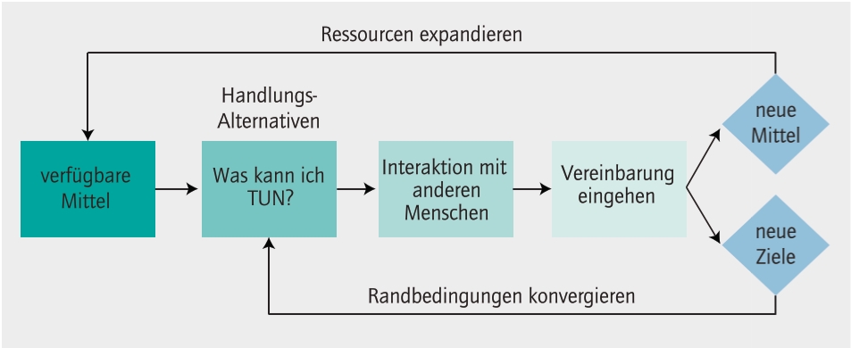
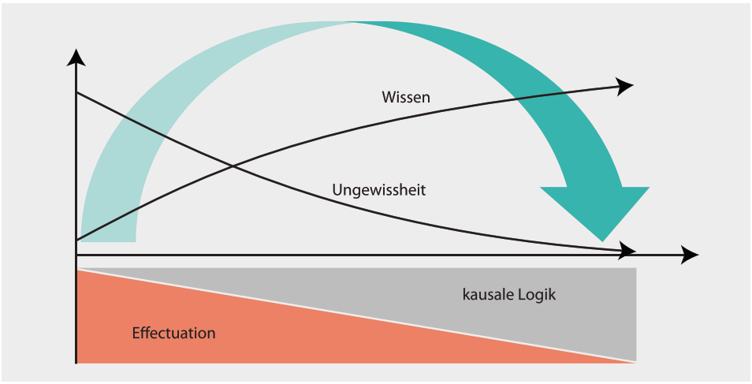
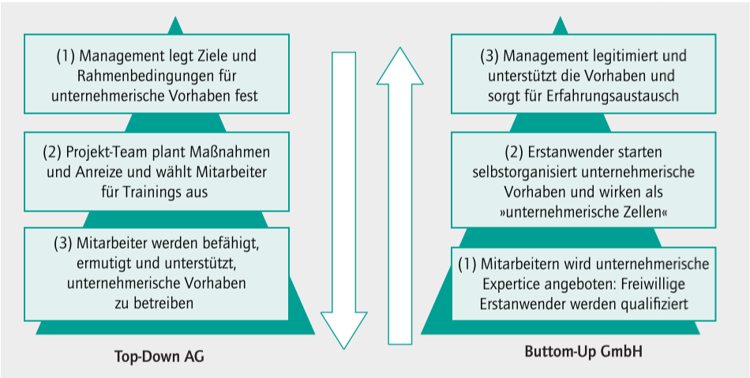

# Summary

## Effectuation
Der Effectuation-Ansatz beschreibt Unternehmerisches Denken und Handeln nicht etwa als Talent 
oder Persönlichkeitsmerkmal, sondern als lernbare Methode.

Was macht Unternehmer Unternehmerisch: 
> Unternehmerischer Erfolg wird häufig mit Talent, Können und Glück sowie günstigen 
> Rahmenbedingungen erklärt.

Es herrscht Ungewissheit im Sinne von Frank Knight: Es existiert keine gültige Basis für 
Prognosen und die Berechnung von Risiken. Hinzu kommt, dass am Anfang solcher Vorhaben noch 
keine Ziele vorgegeben und die Informationen aus dem Umfeld lückenhaft oder mehrdeutig sind. Die 
Grundannahme unternehmerischen Denkens muss daher ohne Elemente des Planbaren auskommen und sich 
stattdessen auf pragmatisch Machbares konzentrieren: "Alles was wir steuern können, brauchen wir 
nicht vorherzusagen"

> Erfolgsaussichten von neuen unternehmerischen Vorhaben sind nicht kalkulierbar.

Erfahrene Unternehmer verzichten also in Ermangelung einer gültigen Informationsbasis auf 
Vorhersagen der Zukunft und setzen stattdessen auf deren unmittelbare Gestaltung.

> Erfahrene Unternehmer konzentrieren sich auf leistbare Einsätze und nicht auf erhoffte Erträge.

Da sich jedoch unter der Prämisse der Ungewissheit der Ertrag von Handlungen nicht einmal 
annähernd prognostizieren lässt, konzentrieren sich erfahrene Unternehmer auf die direkt 
beeinflussbare Grösse: den zu leistenden Einsatz. Ob und welche Handlungen nun durchgeführt 
werden, bestimmt somit nicht der erwartete Ertrag, sondern der leistbare Verlust.

Sie versuchen erst gar nicht, die nach dem eigenen Plan und den vorgegebenen Zielen jeweils 
richtigen Partner auszuwählen. Stattdessen gehen sie auf die Suche nach denjenigen, die bereits 
vor der Fixierung endgültiger Ziele bereit sind, Mittel und Ideen für ungewisse Vorhaben 
einzubringen, und handeln mit ihnen die Zukunft aus.

> Erfahrene Unternehmer suchen nach Partnern, die bereit sind, Mittel und Ideen in ungewisse 
> Vorhaben einzubringen.

Effectuation Prinzipien
* Mittelorientierung
* Leistbarer Verlust
* Umstände und Zufälle
* Vereinbarungen und Partnerschaften

> Das Unerwartete ist für den Unternehmer positiv besetzt und dient als Quelle der Inspiration.

Um dieses Element nutzen zu können, haben erfahrene Unternehmer gelernt, flexibel mit Zielen 
umzugehen und sich den Chancen aus unerwarteten Informationen, Ereignissen oder Begegnungen zu 
öffnen. 

> Ob unternehmerischem oder Management-Denken der Vorzug gegeben wird, ist abhängig vom Grad der 
> Ungewissheit eines Vorhabens. 

Die Alternative dazu ist, die unternehmerische Methode bereits auf deren Einführung in der 
Organisation anzuwenden und einen Prozess zu gestalten, der durch Selbstselektion und 
Selbstorganisation der Mitarbeiter, also Bottom-Up wirkt.

Hemm und Hindernisse für Unternehmerisches Handeln
* Tendenz zur Vorhersage
* Trennung von Entscheiden und Handeln
* Arbeitsteilige Prozesse
* Elemente der Unternehmenskultur

Empfehlungen die zur nachhaltigen Verankerung unternehmerischen Handelns beitragen:
* Innovationsdemokratie
* Interne Märkte
* Agile Prozesse
* Unternehmerische Kultur

